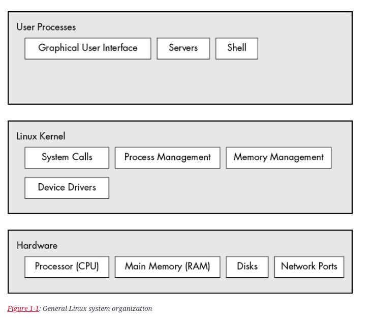

# High Level Components

Overall Linux can be thought of compositions of multiple abstractions, each abstraction can have multiple components.
Here we will discuss different components that essentially built Linux.

Linux is huge and has many abstractions, let's divide these into multiple layers. The 1st layer, the base layer
hardware. Hardware includes memory as well as one or more central processing units (CPUs) to perform computation and to
read and write to memory. Devices such as disk and network interfaces are also part of hardware.

The next level is Kernel, which is the core of operating system. The kernel is software residing in memory that tells
the CPU where to look for its next task. Acting as a mediator, the kernel manages the hardware (especially main memory)
and is the primary interface between the hardware and any running program.

Process (User process) - The running programs that the kernel manages - collectively make up the systems's upper level,
called user space.

### Kernel Mode

There is critical difference between how the Kernel and user process run: The kernel run in _kernel mode_, and the user
process run in _user mode_. Code running in kernel mode has unrestricted access to the processor and main memory. This
is a powerful but dangerous privilege that allows the kernel to easily corrupt and crash the entire system.The memory
area that only kernel can access is called kernel space.

User mode, in comparison, restricts access to (usually quite small) subset of memory and safe CPU operations. _User
space_ refers to the parts of main memory that the user process can access.

> The Linux kernel can run kernel threads, which look much like processes but have access to kernel space. Some examples
> are _kthreadd_ and _kblockd_.

## Hardware: Understanding Main Memory

Of all the hardware on a computer system, main memory is perhaps the most important. In the rawest form, main memory is
just a big storage area for a bunch of 0s and 1s. Each slot for a 0 or 1 is called a bit. This is where the running
kernel and process reside-they are just big collection of bits. All input and output from the peripheral devices flow
through main memory, also as a bunch of bits. A CPU is just an operator on memory; it reads its instruction and data
from the memory and writes data back out to the memory.

## The Kernel

Everything that the kernel does revolves around main memory. The kernel is in charge of managing tasks in four general
system areas:

* **Process** The kernel is responsible for determining which process are allowed to use the CPU.
* **Memory** The kernel needs to keep track of all memory - what is currently allocated to a particular process, what
  might be shared between process, and what is free.
* **Device drivers** The kernel acts as an interface between hardware (such as a disk) and processes. It's usually the
  kernel's job to operate the hardware.
* **System calls and support** Process normally use system calls to communicate with the kernel.

### Process Management

Process management deals with starting, pausing, resuming, scheduling and terminating a process. On modern OS more than
one 
