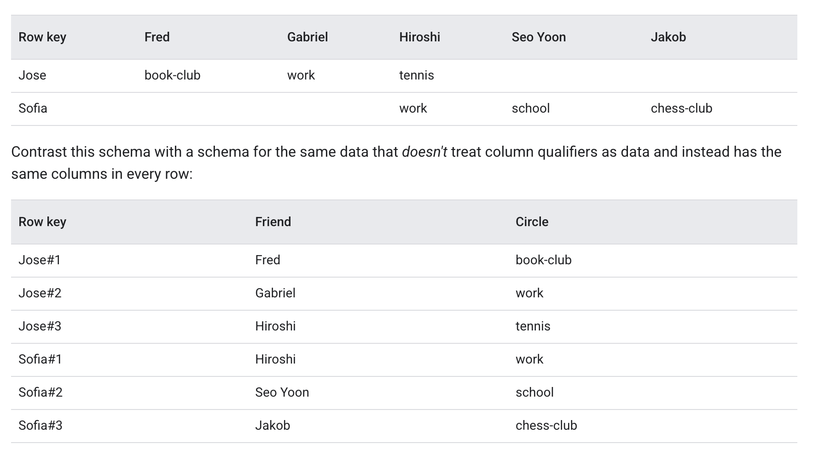

# Tables

A Bigtable _Table_ is a sorted key-valued map that stores data in row and columns. Each row is indexed by single, unique
row key. Columns that are related to each other are typically grouped into column family.

Bigtable has flexible data model, and the tables are sparse. This means that if a column is unused in a row, no data is
stored for the column.
In a row, a column can contain multiple cells, each identified by the four-tuple (row key, column family, column
qualifier, timestamp). Storing multiple cells in a column provides a record of how the stored data for that row and
column has changed over time.

A Bigtable table doesn't support joins, and transactions are supported only within a single row.

A table is an instance-level resource that is automatically replicated to every cluster in the instance. Data retention
is controlled with garbage collection policies that are set at the column-family level.

To optimize performance, Bigtable continuously splits tables across multiple nodes, evenly distributing the amount of
data stored on each node, and keeping frequently accessed rows spread apart where possible. This ongoing process is
automatic.

## Best Practices

### Table

* Store datasets with similar schemas in the same table.
* Keeping number of tables low is recommended for the below reasons:
    * Sending requests to many different tables can increase backend connection overhead, resulting in increased tail
      latency.
    * Creating more tables doesn't improve load balancing and can increase management overhead.

### Column Families

* Keep similar columns in the same column family. This is important as columns of a column family are physically stored
  together in the file. This allows Bigtable to skip scanning all the columns if the query only need two columns of a
  column family, instead the query can point to the particular column family.
* Max 100 column families per table.
* Short names for column families: Names are included in the data that is transferred for each request
* Keep different columns in different column family with different data retention policy.

### Columns

* Creating as many columns as required. BigTable tables are sparse, can have millions of columns, unless row exceeds the
  maximum limit of 256 MB per row.
* Avoid using too many columns in any single row. Even though a table can have millions of columns, a row shouldn't.
    * It takes time for Bigtable to process each cell in a row.
    * Each cell adds some overhead to the amount of data that's stored in your table and sent over the network. For
      example, if you're storing 1 KB (1,024 bytes) of data, it's much more space-efficient to store that data in a
      single cell, rather than spreading the data across 1,024 cells that each contain 1 byte.
* Optionally,column qualifiers can be treated as data. As shown here in the below image, using column qualifier as data,
  the table don't grow as fast as keeping a schema.
  

### Rows

* Keep the size of all values in a single row under 100 MB
* Keep all information for an entity in a single row.
* Store related entities in adjacent rows, to make reads more efficient.

### Cells

* Don't store more than 10 MB of data in a single cell. Recall that a cell is the data stored for a given row and column
  with a unique timestamp, and that multiple cells can be stored at the intersection of that row and column. The number
  of cells retained in a column is governed by the garbage collection policy that you set for the column family that
  contains that column.
* Use aggregate cells to store and update aggregate data.

### Row keys

* Row keys should be based on the data retrieval. The most efficient Bigtable queries retrieve data using one of the
  following:
    * Row key
    * Row key prefix
    * Range of rows defined by starting and ending row keys

  **Other types of queries trigger a full table scan, which is much less efficient.**
* Keep your row keys short. A row key must be 4 KB or less.Long row keys take up additional memory and storage and
  increase the time it takes to get responses from the Bigtable server.
* Store multiple delimited values in each row key. Because the best way to query Bigtable efficiently is by row key,
  it's often useful to include multiple identifiers in your row key. When your row key includes multiple values, it's
  especially important to have a clear understanding of how you use your data.
  > Row key segments are usually separated by a delimiter, such as a colon, slash, or hash symbol. The first segment or
  set of contiguous segments is the row key prefix, and the last segment or set of contiguous segments is the row key
  suffix.
  >
  > Well-planned row key prefixes let you take advantage of Bigtable's built-in sorting order to store related data in
  contiguous rows. Storing related data in contiguous rows lets you access related data as a range of rows, rather than
  running inefficient table scans.
  >
  > If your data includes integers that you want to store or sort numerically, pad the integers with leading zeroes.
  Bigtable stores data lexicographically. For example, lexicographically, 3 > 20 but 20 > 03. Padding the 3 with a
  leading zero ensures that the numbers are sorted numerically. This tactic is important for timestamps where
  range-based queries are used.
  >
  > It's important to create a row key that makes it possible to retrieve a well-defined range of rows. Otherwise, your
  query requires a table scan, which is much slower than retrieving specific rows.
  >
  > For example, if your application tracks mobile device data, you can have a row key that consists of device type,
  device
  ID, and the day the data is recorded. Row keys for this data might look like this:

## Important nuances

1. While creating a new table providing table split, while creating the table multiple row kys can be provided and
   BigTable will split the table at the row key, and store it into different nodes. Row keys can be beneficial when a
   new large table is getting created and Bigtable don't know about the query patterns to split the load across
   different nodes.
2. Modify column families in a table
3. Set garbage collection policies: A garbage collection policy tells Bigtable which data to keep and which data to mark
   for deletion. Garbage collection policies are set at the column family level. These can be provided while creating
   the table or later. Column family can be managed to have number of cells each column in the family must have. If not
   provided it takes default behaviour which depends on the way the table was created.

# Views

There are below types of views in BigTable.

1. Logical View: A logical view – often referred to as just a view – is the result of a SQL query. It functions as a
   virtual table that can be queried by other SQL queries

2. Continuous materialized views: A continuous materialized view is created by continuously running a SQL query against
   a Bigtable table. Bigtable creates a new table based on the query output and keeps it in sync with the source
   table. These Type of views are read only. In a nutshell it creates a new table with a different schema. Hence, the
   costs are also associated with storage of a continuous materialized view as well as for the processing work that goes
   into creating the second table, keeping it in sync with the source table, and replicating it.
3. Authorized views: Authorized views are views of tables that you configure to include specific table data and then
   grant access to separately from access to the source table. It's a subset of the

### Continuous materialized views

In Bigtable, a continuous materialized view is the result of a continuous, fully-managed background process. This
process uses the sql query to create and maintain a precomputed table that Bigtable updates incrementally as the source
data changes.

Data in a continuous materialized view includes the following:

* Aggregated or transformed values that are derived from data in the source table
* Unaggregated values that define the grouping key

---
Reference

1. https://docs.cloud.google.com/bigtable/docs/managing-tables#gcloud
2. https://docs.cloud.google.com/bigtable/docs/schema-design
